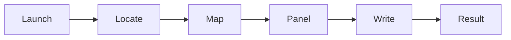

# baldurs-gate-3-trainer ⚔️🎲

  

*A solo-built, standalone companion for Baldurs Gate 3 that gives you a control panel over your own save instead of a save file editor's headache.*

## 🧭 Overview

`baldurs-gate-3-trainer` is a lightweight Windows utility built for players who want direct, real-time control over their Baldurs Gate 3 run without touching the Toolkit, without wrestling with the Script Extender, and without editing a save file by hand and praying it still loads. It attaches to a running instance, reads the values that matter (resources, resistances, action economy, encumbrance) and exposes them as toggles and sliders instead of hex offsets.

This exists because BG3's own difficulty sliders are all-or-nothing. Honour Mode either eats your save on a bad pull, or Explorer Mode removes tension entirely. There was no middle ground for someone who wants to theorycraft a build, test a multiclass combo at level 12, or just stop re-fighting the House of Hope encounter for the ninth time. So this was built — one dev, one goal: ship something that works reliably across patches instead of breaking every Larian hotfix.

It's for solo players doing narrative runs who want quality-of-life adjustments, for build-testers who need to spawn a specific gear combo without a 40-minute run to the vendor, and for anyone replaying the trilogy of acts who just wants the tedious parts to move faster. It is not a multiplayer tool, and it was never designed to be one — this is a single-player companion, full stop.

## 🚀 Get Started

  

---

## 🎒 What's In The Pack

> Each capability below was built to solve one specific in-game annoyance. No filler features, no bloat.

- **Resource Freeze** — lock spell slots, Wild Shape charges, or Action Surge-style resources at a chosen value so you can experiment with rotations without babysitting a resource bar.

- **Camp Supply Override** — set your camp supply count directly instead of grinding vendor runs, useful for long-rest-heavy tactical testing.

- **Carry Weight Unlock** — removes the encumbrance ceiling so inventory management stops being the bottleneck during loot-heavy acts.

- **Turn-Based Pace Control** — speeds up or slows down combat animation pacing, because some fights are fun once and tedious the fortieth time.

- **Companion Approval Nudge** — adjust approval values directly for testing dialogue branches without replaying an entire act to see a reaction.

- **Gold & Currency Panel** — a straightforward numeric field, no vendor exploitation loops required.

- **Camera Freedom** — unlocks camera distance and angle constraints for screenshots, cutscene framing, or just seeing the battlefield better.

- **Hotkey Overlay** — a floating, click-through panel that stays on top of the game window so you never alt-tab mid-fight.

💬 Why not just use console commands?

BG3 doesn't ship a persistent, user-friendly dev console on live builds the way some other RPGs do. What exists is fragile, patch-dependent, and resets constantly. This tool gives you a UI that survives patches better because it targets stable memory patterns instead of a moving console API.

## 🧱 How To Actually Run This

1. Visit the landing page and grab the current build for your patch version.

2. Extract it anywhere — no install wizard, no registry writes, no background service.

3. Launch Baldurs Gate 3 first, get into a save, *then* launch the trainer.

4. Attach, toggle what you need, play.

> [!TIP]
> Attach after you're loaded into a save, not from the main menu. The process handle is more stable once the game engine has finished loading its resource tables.

## 🖥️ System Requirements

| Requirement | Detail |
|---|---|
| OS | Windows 10 (64-bit) or Windows 11 |
| Game | Baldurs Gate 3, Steam or GOG build |
| Dependencies | None — fully standalone executable |
| Install footprint | Zero — no installer, no drivers |
| Admin rights | Recommended for stable memory attach |

> [!NOTE]
> There is intentionally no Linux/Proton support in this build. Steam Deck's memory layout behaves differently enough that supporting it properly would mean maintaining a second codebase — not happening for a solo project right now.

## ⚙️ How It Works

The architecture is deliberately simple because simple things survive patch cycles. Here's the flow:

1. **Locate** — the tool scans for the running BG3 process and confirms the executable version.

2. **Map** — it resolves the memory regions for known value patterns (gold, resources, carry weight) using version-specific offset tables.

3. **Bridge** — a lightweight UI thread renders the control panel and listens for your input.

4. **Write** — toggles and sliders translate into direct, scoped memory writes — nothing touches the save file on disk.

5. **Sync** — values are polled continuously so the UI reflects live game state, not stale numbers.

> [!IMPORTANT]
> Every write is scoped to memory, not disk. Your save file is never modified directly, which is why a botched session can't corrupt your progress the way manual save-editing can.

## 🧯 Common Pitfalls

**Q: The trainer says "process not found" even though the game is running.**
A: You launched the trainer before the game finished loading past the main menu. Get into an actual save first.

**Q: Values snap back to normal after a few seconds.**
A: A background autosave or Larian's own sync tick overwrote the value. Re-toggle after a load or rest completes.

**Q: Windows Defender or SmartScreen is flagging the executable.**
A: This is standard for unsigned indie tools that read process memory. Add an exclusion if you trust the source — signing certificates cost money a solo dev doesn't have yet.

**Q: A new patch dropped and nothing works.**
A: Offsets are version-locked. Check the landing page for an updated build — this is the single most common reason a feature silently stops working.

**Q: Multiplayer / co-op sessions behave oddly.**
A: This tool is built and tested for single-player only. Co-op memory layout is different and unsupported.

**Q: The overlay panel disappeared.**
A: It's click-through by design in some modes — use the hotkey overlay toggle to bring focus back.

## 🎨 UI / UX Details

- **Themes** — dark (default), and a high-contrast mode for streaming/recording clarity.

- **Keyboard Shortcuts**:

  | Key | Action |
  |---|---|
  | `F1` | Toggle overlay visibility |
  | `F2` | Freeze/unfreeze resource panel |
  | `F5` | Refresh memory attach |
  | `Esc` | Detach safely |

- **Settings persistence** — your last-used panel layout and hotkey bindings are saved locally in a small config file next to the executable, nothing phones home.

- **Click-through mode** — lets the overlay sit above the game without stealing mouse focus during combat.

## 🤝 Contributing & Community

This started as a solo project, but issues, offset reports for new patches, and pull requests are genuinely welcome.

- Found a broken offset after a patch? Open an issue with the exact game build number.

- Want to add a feature? Fork it, keep the UI thread lightweight, and open a PR.

- General discussion, build-sharing, and troubleshooting happen in the Issues tab — there's no separate Discord to manage yet.

  

> [!WARNING]
> Pull requests that touch the memory-mapping layer need to be tested against at least two recent game patches before merge. Offset regressions are the number one cause of broken releases.

## 📜 License

Released under the [MIT License](LICENSE), 2026. Do what you want with it, just don't slap your name on it and pretend you wrote it from scratch.

## ⚠️ Disclaimer

This project is an independent, fan-built tool and is not affiliated with, endorsed by, or associated with Larian Studios in any way. It is intended strictly for single-player, offline use. Using memory-modification tools in any online or multiplayer context may violate the game's terms of service — that risk is entirely on you. Back up your save files before use. The maintainer provides this software as-is, with no warranty, because that's how solo open-source projects work.

---

  

